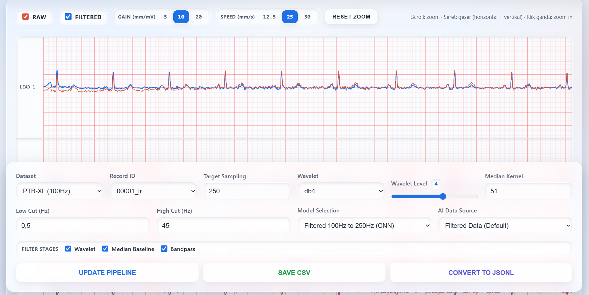
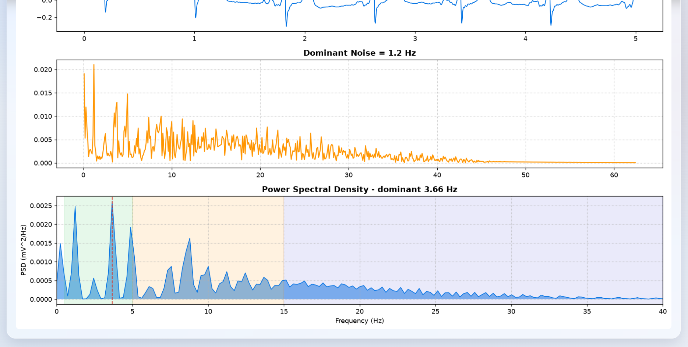

# 🎛️ Wearable ECG Live Clinical Workbench & Hardware DSP Analyzer

Aplikasi workbench klinis berbasis web berkecepatan tinggi yang dirancang untuk memproses, memvisualisasikan, dan menguji sinyal Elektrokardiogram (EKG) 3-Lead secara real-time. Proyek ini mengintegrasikan rekayasa pemrosesan sinyal digital (DSP), instrumentasi perangkat keras medis (ADS1293 + Raspberry Pi), serta inferensi Kecerdasan Buatan (AI) berskema Multi-label untuk deteksi dini aritmia.

Aplikasi ini mengimplementasikan **Clean Layered Architecture** yang memisahkan data access layer, core DSP logic, dan lapisan server web/FastAPI secara ketat untuk menjamin modularitas sistem.

---

## 🚀 Fitur Utama Sistem

### 1. Tab 1: Live Dataset & Hardware Streaming Workbench

- **Multi-Source Dataset Support:** Memuat data dari dataset gold standard publik — PTB-XL Database (100Hz/500Hz), Chapman Dataset (500Hz) — hingga tangkapan fisik mentah perangkat keras (ProSim Simulator via ADS1293) dan folder sensor statis (mV/ADC).
- **Per-Lead Gapless Charts:** Tiga kanvas terpisah (Lead 1/2/3) tanpa celah, masing-masing dengan **toggle filter** (show raw / show cleaned) per lead yang diteruskan sebagai flag ke backend.
- **Clinical Calibration & ECG-Standard Grid:** Gain kalibrasi klinis 5/10/20 **mm/mV** (10 mm/mV standar), grid milimeter 1mm/5mm kedua sumbu yang dijangkar ke titik nol data (0s / 0mV), tampilan kertas EKG standar (25 mm/s).
- **Interactive Preprocessing Pipeline:** Parameter filter dapat diubah langsung dari UI:
  - _Adaptive Wavelet Denoising_ (Daubechies `db4` / Symlets `sym4`) dengan level dekomposisi dinamis (1–6).
  - _Median Filter Baseline Wander Removal_ dengan lebar kernel adaptif.
  - _Butterworth Bandpass Filter_ dengan batas `lowcut`/`highcut` interaktif.
  - _Poly-Resampling Engine_ menuju target spesifikasi model (250Hz).
- **Navigation & Zoom:** Pan vertikal (tarik bidang gambar) + zoom; chart dibangun ulang otomatis saat gain berubah.
- **Real-Time Clinical Holter Dashboard:** Heart Rate (BPM), Mean R-R Interval, HRV (RMSSD), ST Segment Deviation, Corrected QT (QTc).
- **Edge-Computing Profiler:** Pi Edge Latency (ms) dan Peak Memory Allocation (MB).
- **Signal Quality Metrics:** MRD, SDD, dan indikator kualitas sinyal per rekaman.

### 2. Tab 2: ProSim Hardware DSP Study (Studi Distorsi)

- **Gold Standard Simulator Validation:** Menghubungkan berkas tangkapan ADS1293 (`raw_ecg.csv`, ADC) dengan sinyal referensi instrumen (`latest_prosim_calibrated_mv.csv`, mV).
- **Dataset Registry Lookup:** Dropdown sumber mirip Tab 1 — memilih rekaman dari registry dataset (`PTB-XL`, `Chapman`, folder ProSim, folder sensor) lewat format `dataset::record`; pratinjau otomatis memilih jalur *already calibrated* untuk data berbasis dataset.
- **Skip Calibration Recalculation:** Opsi "Sudah calibrated (lewati rekalkulasi)" — melewati perbandingan ADC↔mV untuk data yang memang sudah dalam satuan mV.
- **Lead Selector:** Pilih Lead 1–3 yang dianalisis; hasil ditandai `LEAD n` pada kartu metrik.
- **Komprehensif 5-Metrik Satu Baris:** SIMULATED BPM, SIMULATED RR, ESTIMATED NOISE (FFT), ATTENUATION RATE (% redaman puncak R), dan **SPECTRAL ANALYSIS**.

### 2a. Analisis Spektral & Grafik Interaktif (Tab 2)

- **Inherent Hardware Noise Mapping:** FFT (`rfftfreq`) untuk melacak tumpukan energi derau laten perangkat keras (Power Line 50Hz/60Hz, fluktuasi catu daya).
- **Power Spectral Density (Welch):** Panel grafik PSD dengan pita daya 0.5–5Hz (QRS), 5–15Hz, dan 15–40Hz; penanda frekuensi dominan dan rasio daya per pita.
- **Interactive Filter Distortion Comparison:** Grafik waktu 4 sinyal (Ground Truth, Causal `lfilter`, Zero-phase `filtfilt`, Median) dirender dengan Chart.js — **klik label legenda untuk menampilkan/menyembunyikan sinyal** (semua aktif secara default).
- **Kuantifikasi Redaman Puncak R:** Persentase deviasi pada titik puncak R untuk menguji agresivitas filter, plus kartu **DSP Filter Recommendation**.

### 3. Skema Multi-Label AI Inference Interception

Backend memiliki mesin inferensi model deep learning `.keras` **Multi-Label Classification** (Sigmoid Activation) yang mengenali karakteristik penyakit tunggal maupun komorbiditas ganda menggunakan batas keputusan hasil grid search:

- **Normal:** `0.34` — **AF:** `0.37` — **Takikardia:** `0.57` — **Bradikardia:** `0.57`

- **Open-Set Reject Option:** Jika semua probabilitas di bawah ambang, sistem mengalihkan diagnosis ke kategori **"Others / Ragu-ragu (Unsure)"**.

---

## 📸 Tangkapan Layar

### Tab 1 — Live Dataset & Hardware Streaming Workbench



### Tab 2 — ProSim Hardware DSP Study



---

## 📁 Struktur Repositori Proyek

```text
ecg-wave-preproccess/
├── dataset/                  # Penyimpanan basis data EKG
│   ├── chapman/
│   ├── ptbxl/
│   └── Kalibrasi Prosim/     # Rekaman fisik mentah sensor ADS1293
├── output/
│   └── research_experiments/
│       └── best_model.keras  # Model deep learning hasil eksperimen
├── src/
│   ├── app/
│   │   ├── main.py           # FastAPI Server, Routing API, Inferensi AI
│   │   ├── config.py         # Path global & konstanta hardware (ADS1293)
│   │   └── model_registry.py # Registrasi model & konfigurasi
│   ├── data/
│   │   └── data_layer.py     # Data Access Layer (.mat, .hea, .csv ProSim)
│   ├── logic/
│   │   ├── logic_layer.py    # Pipeline DSP & Holter Metrics
│   │   ├── dsp_simulation_workbench.py  # FFT/PSD & Analisis Distorsi
│   │   ├── preprocessing.py  # Fungsi DSP lanjutan (apply_poly_resample, dst.)
│   │   ├── inference_manager.py, ai_model_manager.py  # Mesin inferensi AI
│   │   └── quality_metrics.py, manifest_manager.py    # Utilitas pendukung
│   └── presentation/
│       ├── index.html        # Dashboard web (Chart.js)
│       ├── script.js         # Logika frontend interaktif
│       └── style.css         # Gaya visual (glassmorphism)
├── venv/                     # Python Virtual Environment
├── screenshots/              # Tangkapan layar tampilan web
├── README.md
└── CHANGELOG.md
```

---

## 🛠️ Cara Menjalankan Proyek

### 1. Prasyarat Sistem

Python 3.10+ (Windows/Linux/macOS) dengan terminal aktif pada direktori utama proyek.

### 2. Aktivasi Virtual Environment & Instalasi Dependensi

```bash
python -m venv venv

# Windows
.\venv\Scripts\activate
# Linux/macOS
source venv/bin/activate

pip install -r requirements.txt
```

### 3. Konfigurasi Awal Path

Buka `src/app/config.py` dan sesuaikan `BASE_DIR` menuju lokasi absolut folder data, contoh:

```python
BASE_DIR = r"D:\Project\ecg-wave-preproccess\dataset"
```

### 4. Menyalakan Server Workbench EKG

```bash
venv\Scripts\python.exe -m uvicorn src.app.main:app --host 127.0.0.1 --port 8000
```

### 5. Mengakses Dashboard

Buka browser (Chrome/Firefox/Safari) lalu akses:

```text
http://127.0.0.1:8000/
```

Sistem workbench klinis interaktif kini siap digunakan.

---

## 📦 Release & Riwayat Perubahan

Riwayat lengkap perubahan terdapat di [CHANGELOG.md](CHANGELOG.md).